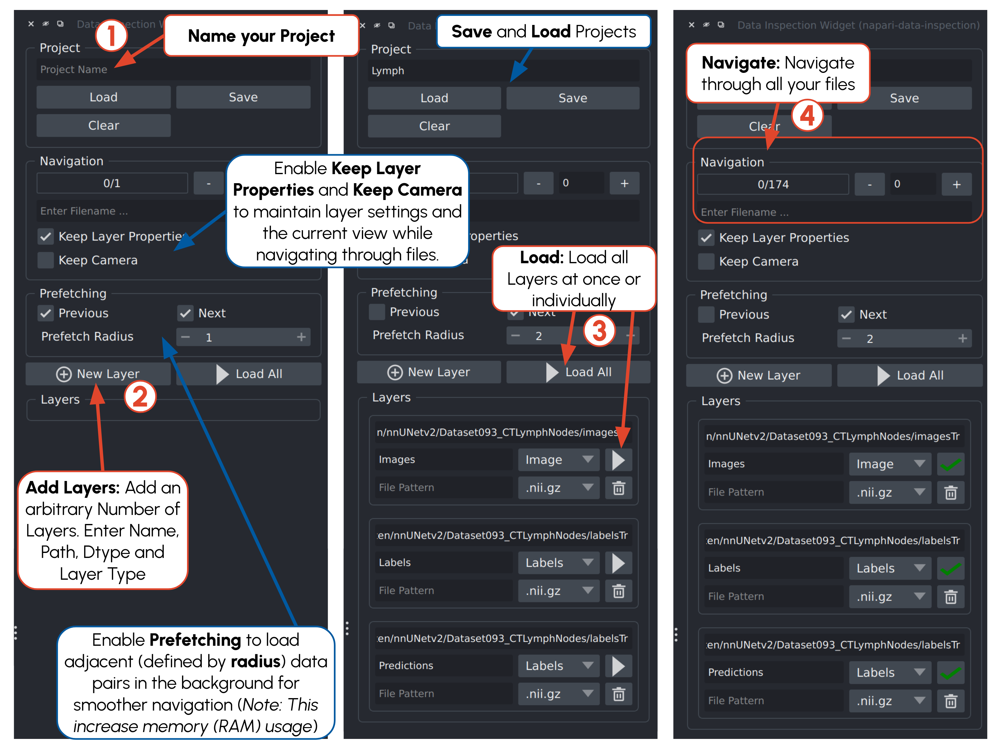

# napari-data-inspection

Load_i
-push_to_cache
-load()
-prefetch_next
-prefetch_previous

TODO

- load when prefetching is activated
- delete when prefetching is deactivated

Data Inspection Plugin, designed to streamline file navigation and enhance the efficiency of data inspection.

## Installation

```
git clone git@codebase.helmholtz.cloud:hi-dkfz/applied-computer-vision-lab/tools/napari_plugins/napari-data-inspection.git
cd napari-data-inspection
pip install -e ./
```

## How to

```
napari -w napari-data-inspection
```



# Acknowledgments

<p align="left">
   &nbsp;&nbsp;&nbsp;&nbsp;
  
</p>

This repository is developed and maintained by the Applied Computer Vision Lab (ACVL)
of [Helmholtz Imaging](https://www.helmholtz-imaging.de/) and the
[Division of Medical Image Computing](https://www.dkfz.de/en/medical-image-computing) at DKFZ.

This [napari] plugin was generated with [copier] using the [napari-plugin-template].

[copier]: https://copier.readthedocs.io/en/stable/
[napari]: https://github.com/napari/napari
[napari-plugin-template]: https://github.com/napari/napari-plugin-template
